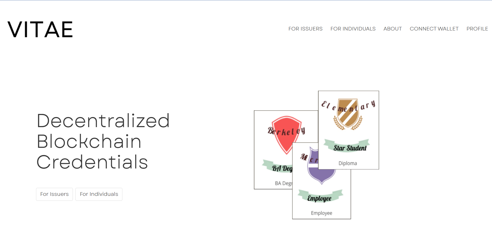
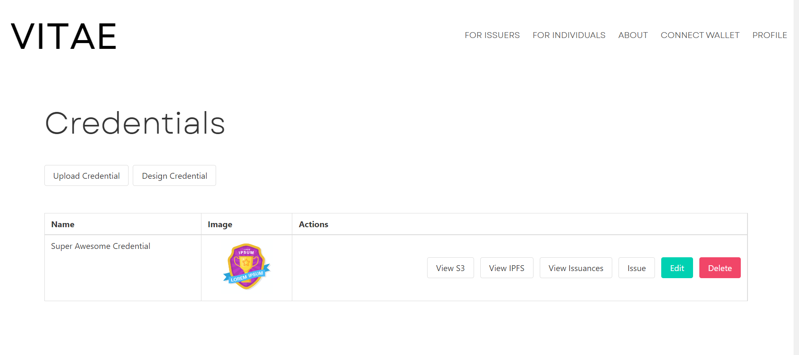
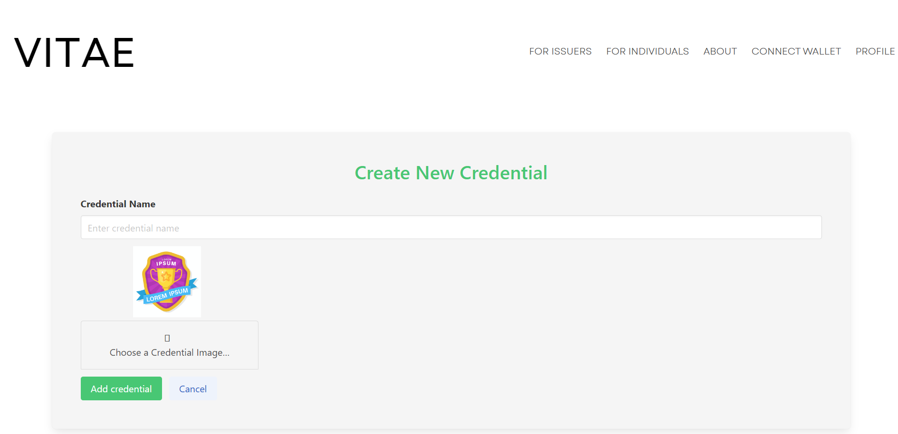
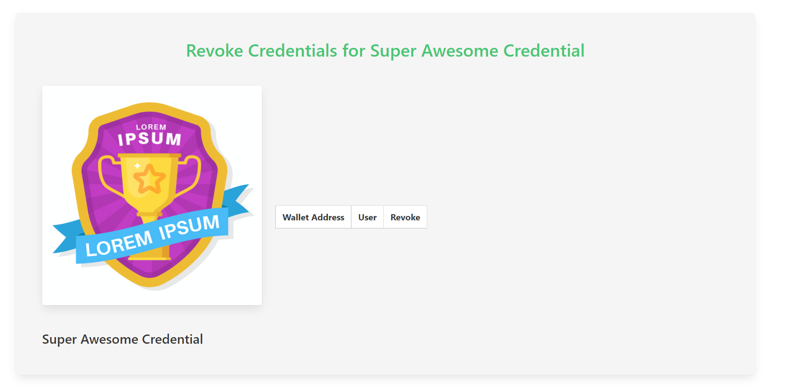
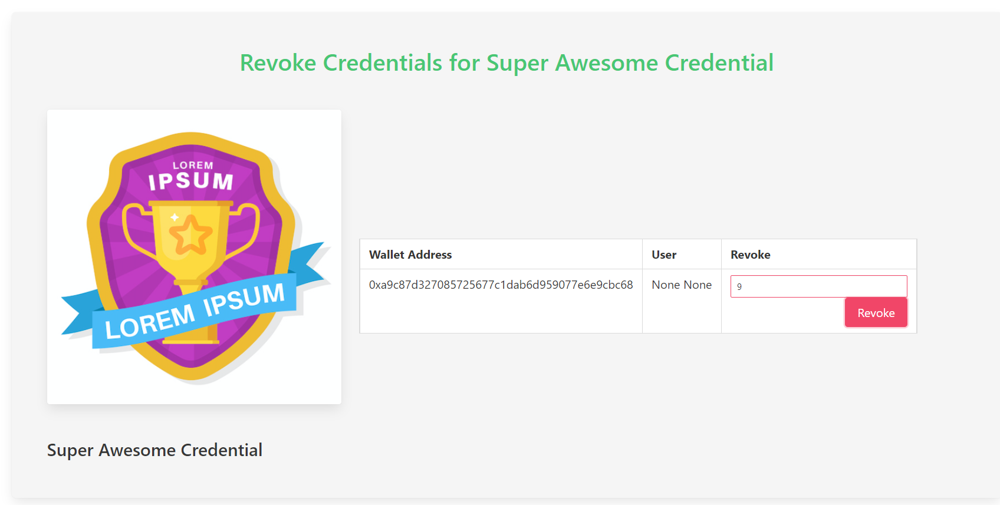

# Vitae Digital Credentials

---

Vitae Digital Credentials is a consumer facing blockchain credentialing platform focused on technology abstraction and ease of use.

This application allows users to create, issue, receive, delete, and revoke ERC-721 standard NFTs that serve as digital credentials. The credentials are non-transferable, but can be burned by the holder of the credential or by the original minter. The platform allows any interested person to create credentials through the smart contract located on the Ethereum Goerli testnet.

The digital credentials created through this platform are meant to represent life's achievements in a verifiable, trustless manner. They can represent college degrees, training certificates, proof of employment or any other use case that an issuing authority chooses to create. These credentials can be used to represent an on-chain resume of a user's personal and professional achievements.

## Technology

---

- Python 3.7.7
- Anaconda Virtual Environment
- Flask 2.2.2
- SQL ALchemy 1.4.42
- PG Admin (Optional)
- Truffle Suite for Blockchain Prototyping
- Goerli Ethereum Testnet
- Infura
- Metamask
- Open Zeppelin ERC-721 standard (v4.7.0)
- Solidity pragma 0.8.4
- Reference the requirements.txt for a list of application dependencies

## Application Best Usage

---

**The preferred method for using this application is to proceed to [this link](https://blockchaincredentials.herokuapp.com/). Import a new Ethereum wallet address into your MetaMask extension and supply it this private key: 245cf72c4e86d2eb6c5bffdd8df6d565f40534572bd95f8b76937bb75e61d72a. Use this address when interacting with the application.**

---

If you prefer to build the application locally, follow the steps below.

The main directory for this application is stored in the /flaskapp directory. The application is being deployed through the application.py file. To run the application ensure that you have an environment set up with all of the necessary dependencies installed. To install these dependencies in your terminal run:

```
pip install -r requirements.txt
```

The /flaskapp/app directory contains the source code for the application including each of the routes and the utility functions used by them. Additionally the schema for the database is designed in the models.py file. The application is built using flask and uses standard conventions to render the HTML stored in the templates directories within each route.
The application is compiled using blueprints which are created in each routes **init**.py file and are referenced via the /app directory's **init**.py file.

Before starting the application, create a .env file in your root directory and insert the following controls:

```
FLASK_ENV = development
debug = true
```

This will allow the application to recompile on changes and return important information for error troubleshooting.
To start the application, navigate to the /flaskapp directory and, after making sure that you are using the correct environment, set the flask app in the terminal using:

```
FLASK_APP=application.py flask run
```

This will set the application.py file as the site of deployment for the application and going forward to start the application simply return to the same directory and run:

```
flask run
```

This will deploy the application locally and allow the user to interact with, and create and deploy their own certificates following proper setup of a Pinata IPFS image hosting account, and a valid blockchain connection.

This Application is Optimized for the Goerli Ethereum Testnet. Transactions may not work on other testnets without reconfiguration of the w3_functions.py file.

## Environment Setup

FLASK_ENV = development
debug = true

### AWS Credentials

AWS_ACCESS_KEY= YOUR_AUTHORIZED_KEY
AWS_SECRET_ACCESS_KEY=YOUR_AUTHORIZED_KEY
S3_CREDENTIAL_BUCKET_NAME=YOUR_AUTHORIZED_KEY
S3_CREDENTIAL_BUCKET_BASE_URL=YOUR_AUTHORIZED_KEY
S3_PROFILE_PIC_BUCKET_NAME=YOUR_AUTHORIZED_KEY
S3_PROFILE_PIC_BUCKET_BASE_URL=YOUR_AUTHORIZED_KEY

### Pinata credentials

PINATA_API_KEY=YOUR_AUTHORIZED_KEY
PINATA_API_SECRET_KEY=YOUR_AUTHORIZED_KEY
PINATA_JWT_KEY=YOUR_AUTHORIZED_KEY

### WEB 3 Provider

WEB3_PROVIDER_URI=YOUR_AUTHORIZED_KEY
SMART_CONTRACT_ADDRESs=YOUR_AUTHORIZED_KEY
ETHEREUM_PRIVATE_KEY=YOUR_AUTHORIZED_KEY

## Smart Contract Details

---

The smart contract is based on Oppen Zeppelin's ERC-721 standards (v 4.7.0) with some added functionality. An override had been added to the \_beforeTokenTransfer function to prevent any of our credentials from being transferred.

The largest addition to the smart contract is the bestowCredential function. This function requires the address you are issueing the credential to and the uri that hosts said credential. It uses a modified version of the \_mint function.

RevokeCredential and deleteCredential can both be used to call the burn function from the owner and issuer of the credential respectively.

## Road Map

---

- Build the application on zkSync's testnet
- Provide a wallet creation feature for issuing organizations or persons through smart contract wallet providers
- Incorporate immutable metadata storage

## App Architecture

---


## Application Demo

### Homepage

---



Currently connectivity with MetaMask or other wallet providers is not supported in the application. Make sure to save your Ethereum private key in your local .env in order to sign transactions.

### Profile Page

---


The profile page is completely voluntary information and nothing on that page is required to use the application. This profile page exists for future use in the event users want to supply personal data to facilitate email notifications from the application.

### Issuers Page

---



The issuers page is where anyone can upload a credential image file or design a credential. Once the credential is created here it is pinned to IPFS and stored in a local database. Once created, issuers can click on "issue", which will invoke the smart contract functions through the Goerli testnet.

### Credential Design Page

---


### Credential Upload Page

---



### Credential Administration Page

---



This page is accessed through "view issuances" from the issuers page. This allows the issuer to revoke credentials that are being held in other wallets.

### Revoke Credential Page

---



Revoke the credential by supplying the tokenId which can be found from Goerli testnet etherscan, by supplying the minted credential transaction hash.
